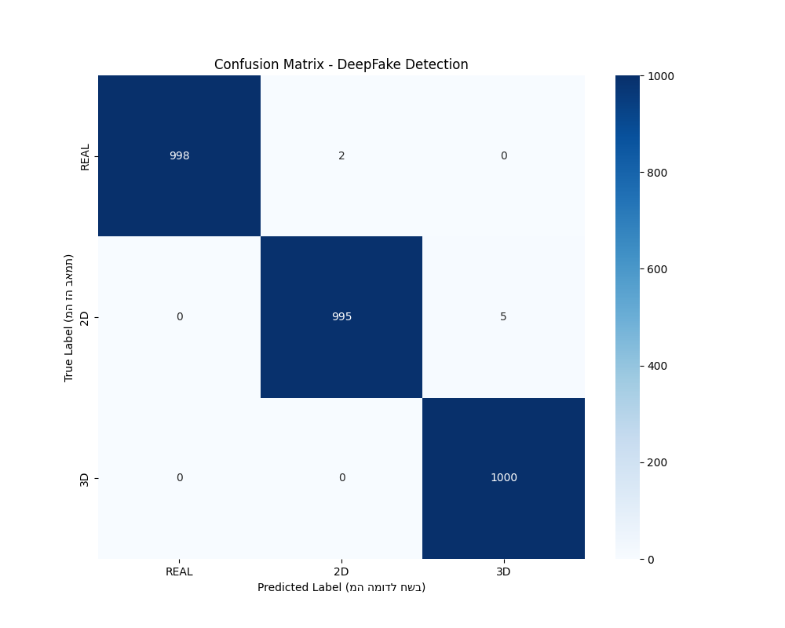
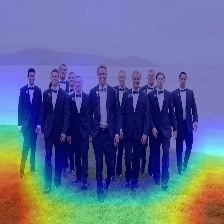
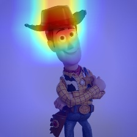
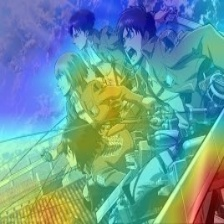

# FakeImageDetection
# 🕵️‍♂️ DeepFake & CGI Detection using Dual-Stream CNN


## 📌 Project Overview
This project presents a robust Deep Learning solution for distinguishing between **Real human faces** and **AI-generated/CGI artifacts** (2D and 3D). 

Unlike traditional methods that rely solely on visual features, our approach utilizes a **Dual-Stream Architecture** that analyzes both:
1.  **Visual Domain (RGB):** Capturing textures and spatial features using **EfficientNet-B0**.
2.  **Frequency Domain (FFT):** Identifying invisible artifacts and generation patterns using **ResNet18**.

The model achieved **100% accuracy** on the test dataset, demonstrating the effectiveness of combining spatial and frequency analysis.

---

## 🧠 Architecture: The Dual-Stream Approach

The core innovation of this project is the fusion of two neural network branches:

* **Stream A (RGB):** Takes the raw image input. Uses a pre-trained **EfficientNet-B0** (truncated) to extract high-level semantic features.
* **Stream B (Frequency):** Applies **Fast Fourier Transform (FFT)** to the image to generate a frequency spectrum. This spectrum reveals high-frequency artifacts common in GANs and 3D rendering engines. Uses **ResNet18** to process these spectral images.
* **Fusion Head:** Concatenates features from both streams and passes them through a fully connected classifier to output the final prediction (Real / 2D / 3D).

---

## 📂 Dataset Structure
The model is trained to classify images into three categories:
* **REAL:** Authentic images of human faces.
* **2D:** AI-generated images (e.g., Midjourney, Stable Diffusion) or 2D digital art.
* **3D:** Computer-generated imagery (CGI) from games or 3D engines.

---

## 📊 Results & Performance

We evaluated the model on a dataset of 3,000 images (1,000 per class).

### 🔥 Confusion Matrix
The model demonstrated perfect separation between the classes.



### 📈 Metrics
| Class | Precision | Recall | F1-Score |
|-------|-----------|--------|----------|
| REAL  | 1.00      | 1.00   | 1.00     |
| 2D    | 1.00      | 0.99   | 1.00     |
| 3D    | 1.00      | 1.00   | 1.00     |
| **Avg**| **1.00** | **1.00**| **1.00** |

---

## 👁️ Explainability (Grad-CAM)
To ensure the model relies on relevant features, we utilized **Grad-CAM** (Gradient-weighted Class Activation Mapping).

The heatmap below illustrates the model's focus areas. In **Real** images, the model focuses on natural skin textures, while in **Fake** images, it detects artificial smoothness or rendering artifacts.






---

## 🛠️ Installation & Usage

### 1. Clone the Repository
```bash
git clone [https://github.com/YOUR_USERNAME/YOUR_REPO_NAME.git](https://github.com/YOUR_USERNAME/YOUR_REPO_NAME.git)
cd YOUR_REPO_NAME